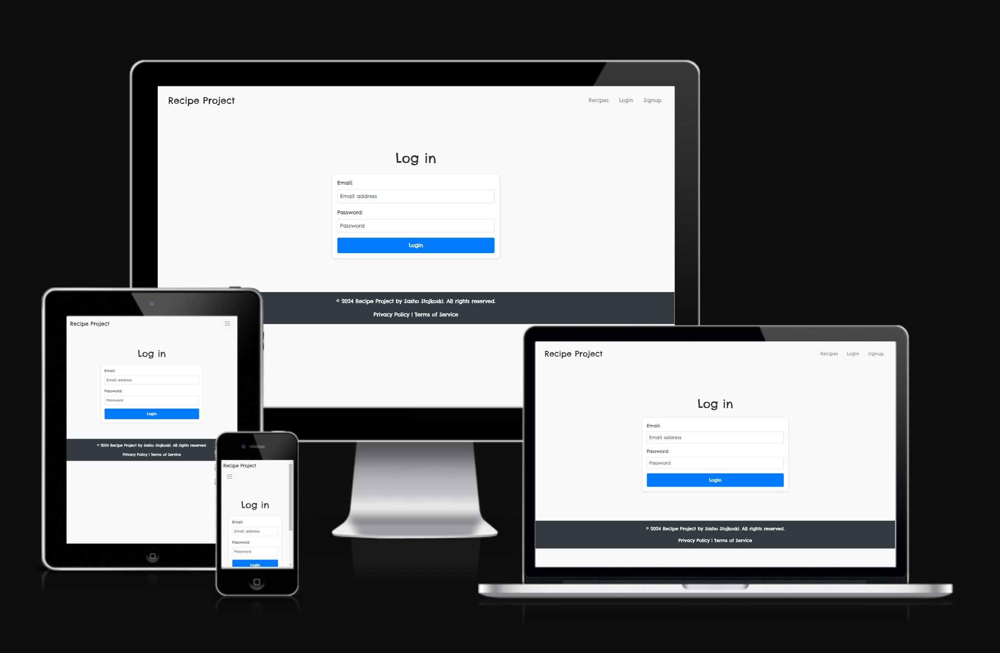
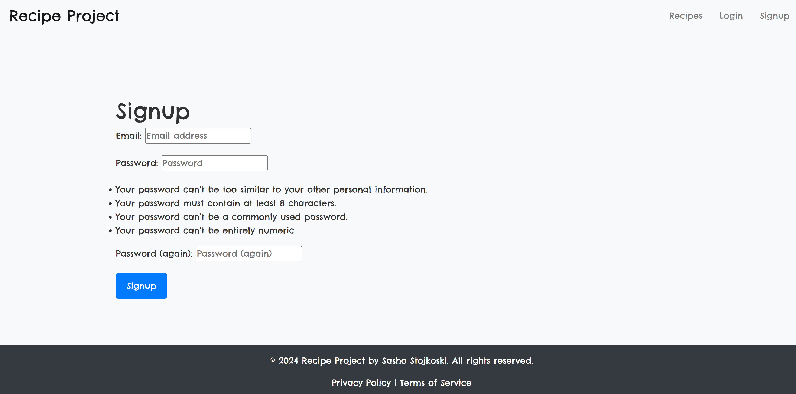
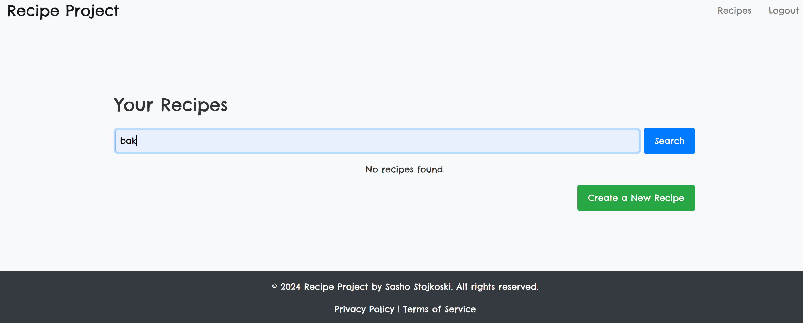

# Django Recipe Blog

The Django Recipe Blog is a web application built using the Django web framework. This app allows users to create, manage, and explore various recipes. Users can add, edit, and delete recipes, as well as upload images to accompany their culinary creations.

## Table Of Contents:
1. [User Stories](#user-stories)
2. [Features](#features)
3. [Future Features](#future-features)
4. [Technologies Used](#technologies-used)
5. [Testing](#testing)
6. [Deployment](#deployment)
7. [Credits](#credits)

## User Stories

User stories define the functionality and features of the Recipe Blog app from the end-users' perspective:

- As a user, I want to register and create an account so that I can manage my own recipes.
- As a user, I can log in or log out to ensure my recipes are secure.
- As a user, I want to create new recipes with a title, ingredients, and instructions.
- As a user, I want to upload images to better illustrate my recipes.
- As a user, I want to edit my recipes to update them.
- As a user, I want to delete my recipes that I no longer need.
- As a user, I want to search for recipes by title or ingredients.
- As a user, I want to view all my recipes in a personal dashboard.

## Features 

- **User Registration and Authentication:** Users can create accounts, log in, and securely manage their recipes.
 (docs/images/login.png)

- **Recipe Management:** Users can add, edit, and delete recipes, and upload images to make their recipes more appealing.
 

- **Search Functionality:** Users can search for recipes based on the title or ingredients.
  

## Future Features

There are a few features that I would like to implement in future releases:

- **Recipe Rating System:** Allow users to rate recipes to help others discover the best ones.
- **Comment Section:** Enable users to leave comments on recipes.
- **Recipe Sharing:** Allow users to share recipes on social media.

## Technologies Used

- **[Django](https://www.djangoproject.com/):** Python-based web framework.
- **[Python](https://www.python.org/):** Programming language used for backend development.
- **[Bootstrap](https://getbootstrap.com/):** CSS framework for responsive design.
- **[HTML](https://en.wikipedia.org/wiki/HTML):** Markup language for creating web pages.
- **[CSS](https://en.wikipedia.org/wiki/CSS):** Style sheet language for designing web pages.
- **[JavaScript](https://en.wikipedia.org/wiki/JavaScript):** Programming language for interactive web elements.
- **[PostgreSQL](https://www.postgresql.org/):** Database used in development.

## Testing

### PEP8 Testing Screenshots

(docs/images/pep8_1.png)
(docs/images/pep8_2.png)
(docs/images/pep8_3.png)
(docs/images/pep8_4.png)
(docs/images/pep8_5.png)

### Lighthouse Testing Screenshots

### User Story Testing

#### User Registration and Login
- **Scenario:** User registers a new account.
  - **Test:** Ensure that users can register, log in, and access their dashboard.
  - **Result:** Pass
  
#### Recipe Creation
- **Scenario:** User creates a new recipe.
  - **Test:** Verify that users can successfully create and save recipes.
  - **Result:** Pass

#### Recipe Editing and Deletion
- **Scenario:** User edits or deletes a recipe.
  - **Test:** Ensure that users can edit existing recipes and delete recipes they no longer need.
  - **Result:** Pass

### Manual Testing
| Feature               | Test Performed                                                     | Result  |
|-----------------------|--------------------------------------------------------------------|---------|
| Recipe Creation       | Users can create a new recipe.                                     | Pass    |
| Recipe Editing        | Users can edit an existing recipe.                                 | Pass    |
| Recipe Deletion       | Users can delete a recipe.                                         | Pass    |
| Image Upload          | Users can upload an image when creating or editing a recipe.       | Pass    |
| Search Functionality  | Users can search for recipes by title or ingredients.              | Pass    |
| Responsiveness        | The app layout adjusts according to device size.                   | Pass    |

### Automated Testing

Automated tests were created using Django's test framework:

- **Views Testing:** Confirm that the correct templates are rendered and HTTP responses are as expected.
- **Models Testing:** Validate that models behave as expected, including default values and field constraints.

## Deployment

The app was deployed to Heroku using the following steps:

1. **Create Repository on GitHub:**
   - Set up a new repository using the Django template and clone it locally.

2. **Install Dependencies:**
   - Install required dependencies including Django, Pillow, and others listed in `requirements.txt`.

3. **Create Heroku App:**
   - Log in to Heroku, create a new app, and connect it to the GitHub repository.

4. **Set Environment Variables:**
   - Configure environment variables for sensitive data such as `SECRET_KEY` and `DATABASE_URL`.

5. **Deploy to Heroku:**
   - Deploy the app from the `main` branch of your GitHub repository.

6. **Migrate Database:**
   - Run database migrations on Heroku to set up the database schema.

7. **Collect Static Files:**
   - Use `python manage.py collectstatic` to collect static files for deployment.

## Credits

- **Code Institute:** For providing the foundation in Django development through their tutorials.
- **YouTube Tutorials:** Several tutorials were used to understand and implement features in the app.
- **Chat GPT:** For providing help and knowledge used in the project.
